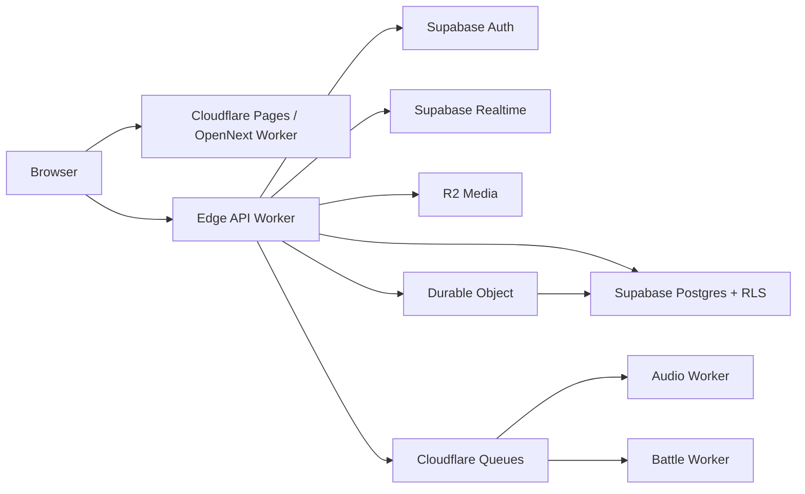

# RapYard Cloudflare + Supabase Architecture

RapYard runs the Next.js application through OpenNext on a Cloudflare Worker. Static assets are served by the Worker asset binding. Supabase is the system of record for Auth, Postgres metadata, RLS, and Realtime. Audio and rendered media should move to R2 as the media pipeline grows.

## Services

- `rapyard-club-web`: OpenNext application and browser routes.
- `rapyard-router`: authenticated edge API facade and webhook receiver.
- `audio-worker`: waveform, loudness, format conversion, and R2 cleanup.
- `battle-worker`: idempotent vote closing, winner settlement, XP, and credits.
- Durable Objects: live Cypher presence, round timers, and room coordination.
- Supabase: magic-link Auth, relational metadata, RLS, and Realtime events.
- R2: recordings, published audio, cover artwork, and derived waveforms.

Keep browser code on publishable Supabase keys. Server actions and Workers must verify the user JWT before mutations. Secret keys belong only in server-side secrets. Issue signed R2 URLs after checking ownership or publication status in Supabase.

## Five product screens

| Screen | Route | Supabase domain | Cloudflare role |
| --- | --- | --- | --- |
| Onboarding cinematic | `/onboarding` | `profiles`, `progression_events` | auth callback and profile completion |
| Record Flow | `/booth` | recording sessions and takes | signed upload and audio queue |
| Cypher Mode | `/cypher/:id` | `cyphers`, members, entries | Durable Object presence and timer |
| Battle Arena | `/battles/:id` | matches, entries, votes | settlement queue and result event |
| Mixtape Builder | `/tapes/:id` | mixtapes and ordered tracks | publish/render queue |

## Loops

- Progression: append an event, then atomically update the wallet/profile projection. Unlocks are derived from level and badge rules, never trusted from the client.
- Economy: credits are ledgered as progression events; a server-side transaction validates balance before marketplace spend.
- Creator: a saved take references media metadata, then an async Worker creates waveform/derivatives and emits reactions/follower events.
- Community: Cypher and battle state is live at the edge, while completed rounds and rewards are durable in Postgres.

Apply `db/010_cyphers_battles_tapes.sql` after the existing migrations. It is additive and leaves the legacy `battles` and `tracks` tables available during UI migration.
